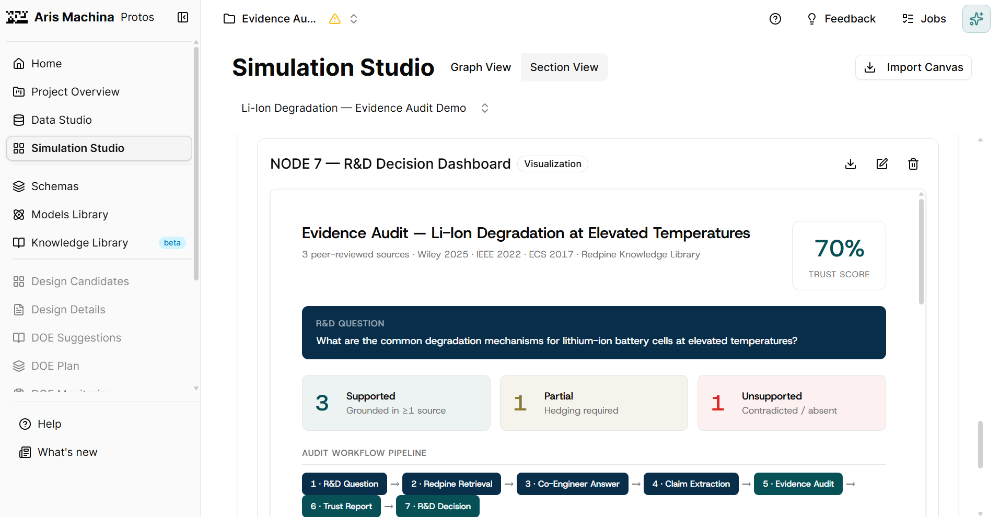
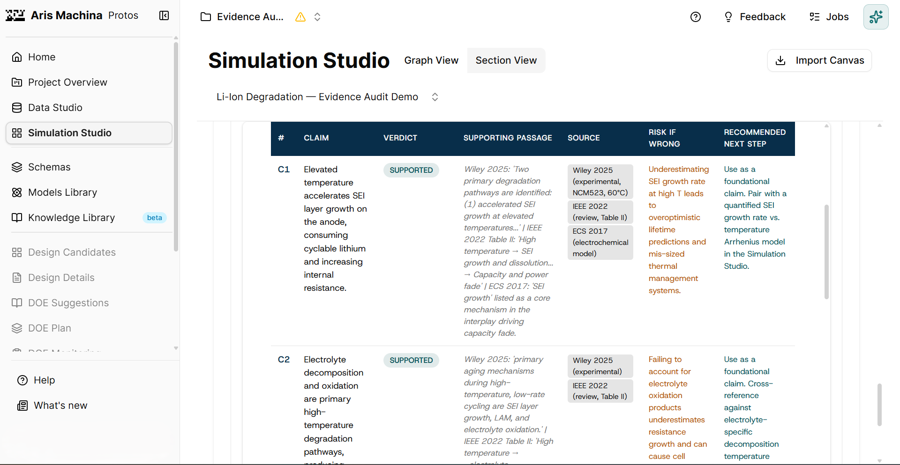
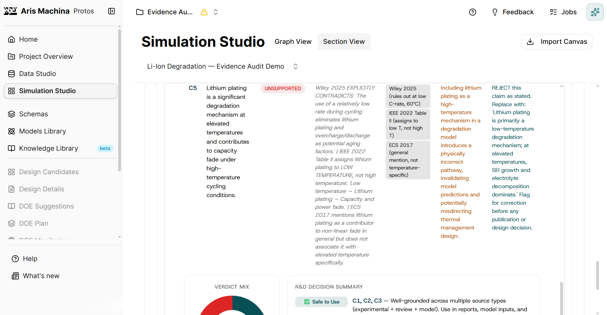
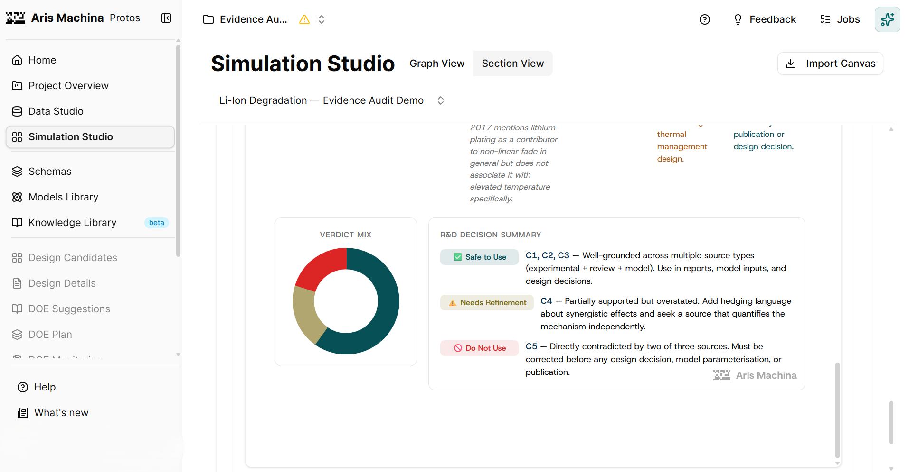
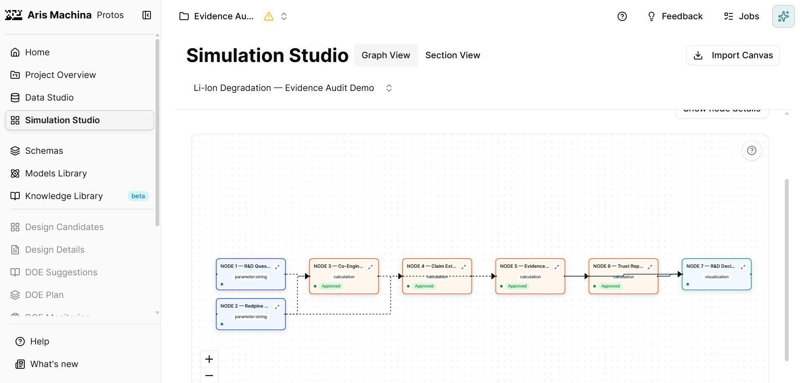

# Evidence Audit — Trust Layer for AI-Assisted R&D

> A hackathon prototype that audits AI-generated R&D claims against licensed scientific sources — before engineers act on them.

Built solo at the **Aris Machina × Redpine / Aris & Friends Hackathon**, Stockholm, May 26, 2026.

---

## Context

This is a proof-of-work repository documenting a hackathon prototype. It is primarily documentation and architecture, not a fully runnable application. The goal is to show an applied AI architecture pattern: generate an AI answer, extract its claims, verify each claim against trusted sources, and produce a structured trust report.

**Positioning:** Claude reasons. Redpine grounds. Protos operationalizes.

- Claude / Co-engineer performs the reasoning
- Redpine provides the licensed scientific evidence
- Protos turns the process into a visible, repeatable R&D workflow

---

## Problem

When an R&D engineer asks an AI assistant a technical question, the AI returns a confident, well-structured answer. But in industrial R&D, acting on an unsupported claim can mean failed experiments, mis-designed prototypes, or unsafe decisions.

The engineer's real question is not "what does the AI say?" — it is **"which parts of this answer are actually grounded in the scientific literature?"**

Manually tracing every claim back to source papers takes hours and defeats the purpose of using AI.

---

## What Evidence Audit Does

Evidence Audit takes an AI-generated answer and audits it claim by claim against retrieved scientific sources. Each claim receives a verdict:

- **SUPPORTED** — directly backed by a source passage
- **PARTIALLY SUPPORTED** — related evidence exists, but the specific claim is not fully confirmed
- **UNSUPPORTED** — no retrieved source supports the claim, or sources contradict it

The output is a structured trust report with claim, verdict, evidence summary, source references, risk-if-wrong, and recommended next step.

---

## Architecture

```
R&D Question
    ├── Redpine Retrieval ──┐   (licensed scientific data)
    │                       │
    └──────────────────────→ Co-Engineer Answer   (Claude reasoning)
                                    │
                                    ▼
                            Claim Extraction
                                    │
                                    ▼
                            Evidence Audit         (per-claim verification)
                                    │
                                    ▼
                            Trust Report
                                    │
                                    ▼
                          R&D Decision Dashboard
```

See [docs/architecture.md](docs/architecture.md) for a node-by-node breakdown.

---

## Demo Result

**Question:** What are the common degradation mechanisms for lithium-ion battery cells at elevated temperatures?

**Sources retrieved via Redpine:** Wiley (2025), IEEE (2022), ECS (2017)

| # | Claim | Verdict |
|---|---|---|
| C1 | SEI layer growth accelerates at elevated temperature | ✅ SUPPORTED |
| C2 | Electrolyte decomposition / oxidation at high temperature | ✅ SUPPORTED |
| C3 | Cathode / transition-metal dissolution | ✅ SUPPORTED |
| C4 | Loss of active material (LAM) | ⚠️ PARTIALLY SUPPORTED |
| C5 | Lithium plating as a significant high-temperature mechanism | ❌ UNSUPPORTED |

**Trust Score: 70%** — 3 supported, 1 partially supported, 1 unsupported.

**Key finding:** C5 was contradicted by the retrieved sources. Lithium plating is primarily a low-temperature mechanism. Without the audit, this incorrect claim could enter a degradation model unchecked.

---

## Why This Matters

The pattern — generate, extract claims, verify against trusted sources, produce verdicts — is domain-agnostic. It applies wherever AI-generated content must be verified before action: pharmaceutical research, regulatory compliance, technical documentation, financial and legal analysis.

The value is the verification layer itself, not the specific domain.

---

## Screenshots

### Dashboard: Trust Score



### Evidence Audit Table



### Unsupported Claim: Lithium Plating



### R&D Decision Summary



### 7-Node Workflow



---

## Tech / Workflow Stack

- **Protos (Aris Machina)** — R&D workflow workspace, Simulation Studio, Canvas
- **Redpine** — licensed scientific data access via MCP
- **Claude / Co-engineer** — AI reasoning and per-claim verification
- **Workflow** — 7 connected nodes from question to decision

---

## Limitations

This is a hackathon prototype built in roughly 4 hours. See [docs/limitations.md](docs/limitations.md) for the full list. In short:

- Not a production system
- No independent benchmark
- Tested on a single domain and example
- Source passages are not reproduced here (licensed data)
- Audit quality depends on retrieval quality

---

## Future Improvements

See [docs/future-work.md](docs/future-work.md). Highlights: production API version, automated evaluation set, per-claim confidence scoring, source-contradiction detection, human-in-the-loop review, and integration with existing R&D tools.

---

## Disclaimer

This repository documents a hackathon prototype. It is not production-ready and does not "solve hallucination." It demonstrates an architecture pattern for verifying AI outputs against trusted sources. The project was built at the Aris Machina × Redpine hackathon using Protos and Redpine; this does not imply any further affiliation with or endorsement by Aris Machina or Redpine. Licensed source passages are not reproduced in this repository.

---

## Author

**Arjun Ponnaganti** — applied AI systems, RAG, evaluation, and automation.

Building **arjunworks** — grounded AI workflows that verify outputs before people act.

GitHub: [github.com/AIArjun](https://github.com/AIArjun)
